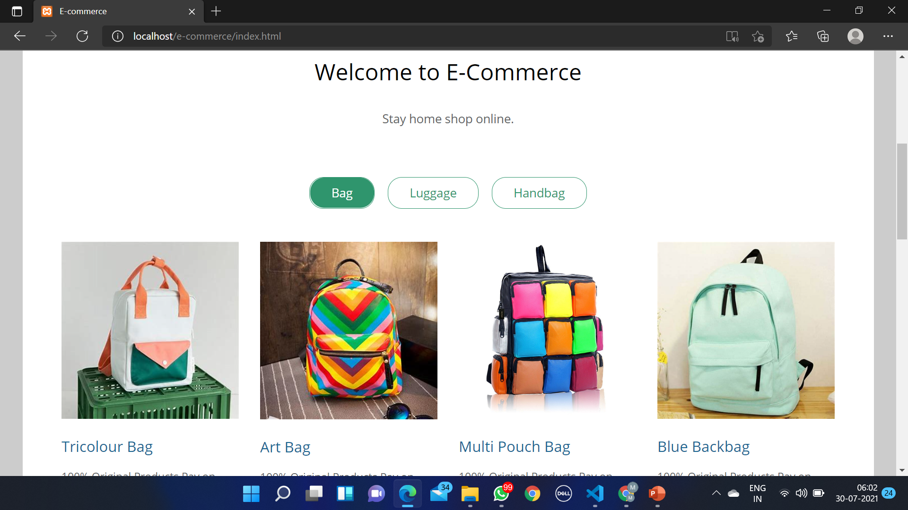

# E-commerce-website
Web Development intern - The intern academy

 Hi I made this website to implement e-commerce site @<b>The Intern Academy</b> Task as Web Developer Intern.

<h2 color="green">E-COMMERCE WEBSITE</h2>

Create an e commerce website with carts. The site will show various items and whoever wants to buy will simple find its rate and book it with address details and save it to database
 
<h1>Demo:</h1>
<b>Youtube Link:<b><a href="https://youtu.be/LySNy_vqYyA">here<a>   
<b>Linkedin Post:<b><a href="https://www.linkedin.com/posts/mathu-mitha-0541421b1_webdevelopment-connections-websitedesign-activity-6826686385005699072-t2cY">here<a>   
 
    
    
<h3>FOLLOW:</h3>
<li><a href="https://www.linkedin.com/in/mathu-mitha-0541421b1">LinkedIn</a>
<li><a href="https://www.instagram.com/shruthi_mathu/hik">Instagram</a>
<li><a
href=
"https://youtube.com/channel/UCTrkFigM5wkZGp0kQMxTd3A">YouTube</a>
<li><a href=
"https://twitter.com/v_mathumitha?s=08">Twitter</a>

